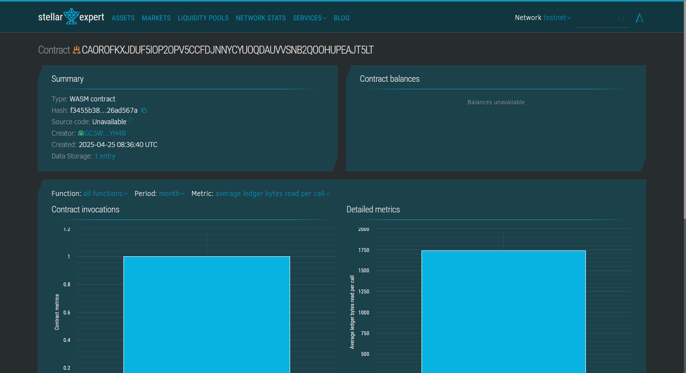

# Health Monitoring Wearable App

## 📄 Project Description
This project leverages blockchain-based smart contracts (using Soroban SDK) to securely store and monitor vital health parameters from wearable devices. It ensures decentralized, tamper-proof, and transparent access to health data, enhancing both security and reliability.

## 👁️ Project Vision
To create a decentralized and secure infrastructure for real-time health monitoring, where users have full control over their sensitive medical data and doctors can access trusted insights for proactive care.

## 🚀 Key Features
- **Submit Health Data**: Allows users to store vitals like heart rate and temperature from their wearable devices.
- **Retrieve Health Data**: Enables retrieval of the latest stored health information for any registered user.
- **Vital Alert System**: Automatically checks for abnormal readings (e.g., high temperature or heart rate) and notifies users.
- **Blockchain Security**: Health data is stored securely on the blockchain using Soroban smart contracts.

## 🔮 Future Scope
- Integration with IoT devices and smart wearables for real-time streaming.
- Addition of more health parameters (e.g., blood oxygen, ECG, etc.).
- AI-based predictive analytics for early diagnosis.
- Doctor-patient data sharing permissions via tokenized access.
- NFT-based health identity wallets.

## Transaction 

-Contract address :     CAOROFKXJDUF5IOP2OPV5CCFDJNNYCYUOQDAUVVSNB2QOOHUPEAJT5LT
